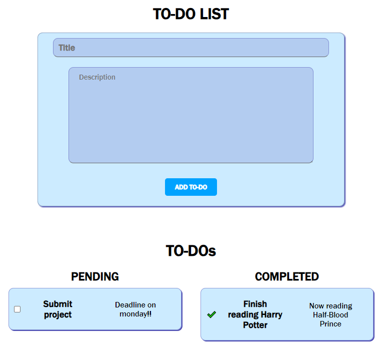

# [OIBSIP] Dynamic To-Do List Web Application
## LEVEL 2 TASK 3

🚀 Welcome to the Dynamic To-Do List Web Application project! Manage your tasks with ease using this sleek and responsive web app.

## Features

- **Add To-Dos**: Easily add new tasks with titles and descriptions.
- **Pending and Completed Lists**: Organize your tasks into two sections, "Pending" and "Completed," for a clear overview.
- **Dynamic Updates**: Tasks transition to the "Completed" section when marked as done.
- **Stylish Design**: A modern design with a calming color scheme.
- **Responsive**: Works seamlessly on any device.

## Preview

## Demo
[Check out live demo ](https://github.com/PavanBhat007/OIBSIP)
